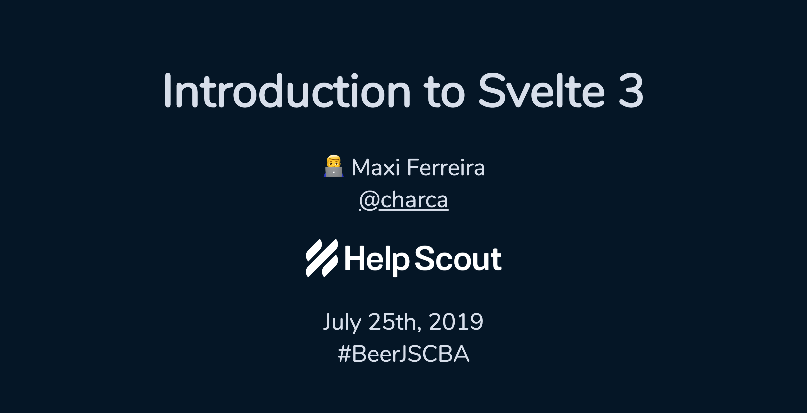
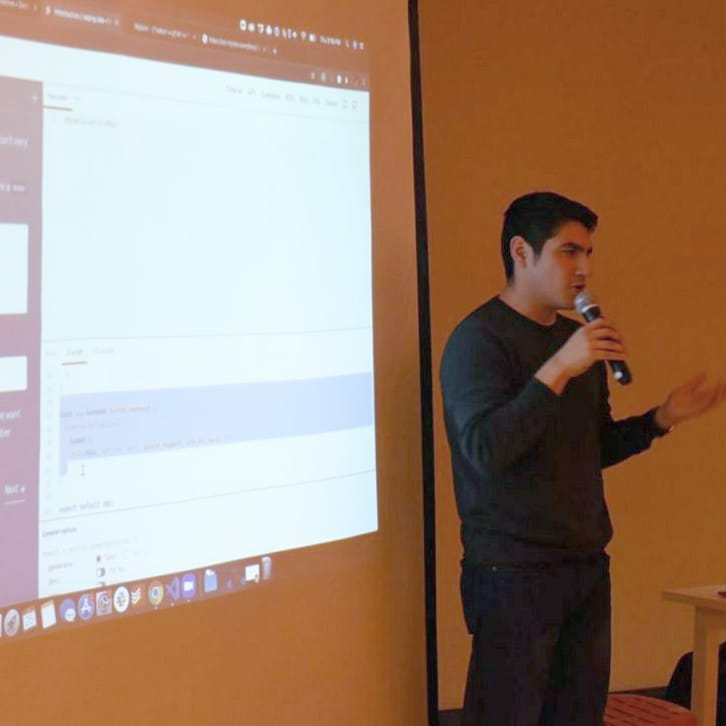

# Introduction to Svelte 3

Talk given at [BeerJS Córdoba](https://beerjscba.com/) No. 32 on July 25th, 2019. This talk was originally given in Spanish, English slides are available [here](https://svelte-beerjs.surge.sh/).

**📽️ The video in Spanish and with very bad quality audio can be watched [here](https://www.youtube.com/watch?v=N5g0dFfz9iQ)**

Made with [MDX Deck](https://github.com/jxnblk/mdx-deck).

# Photos

