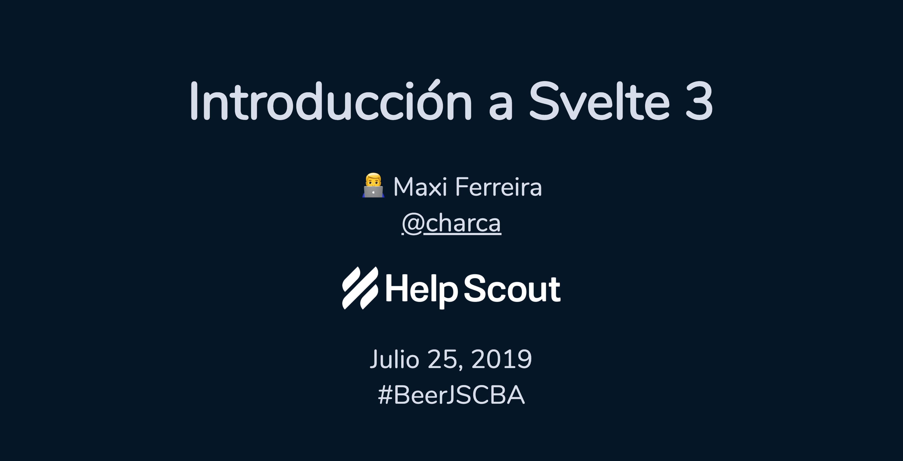
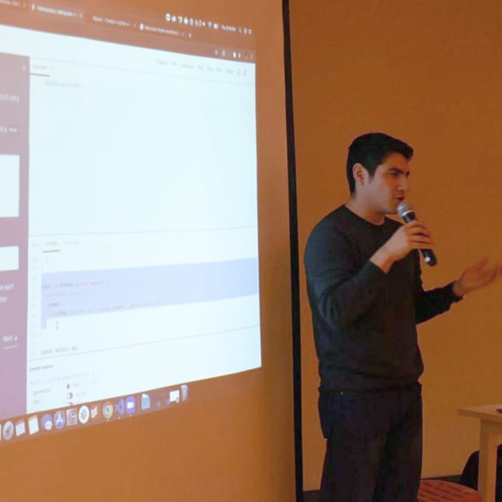
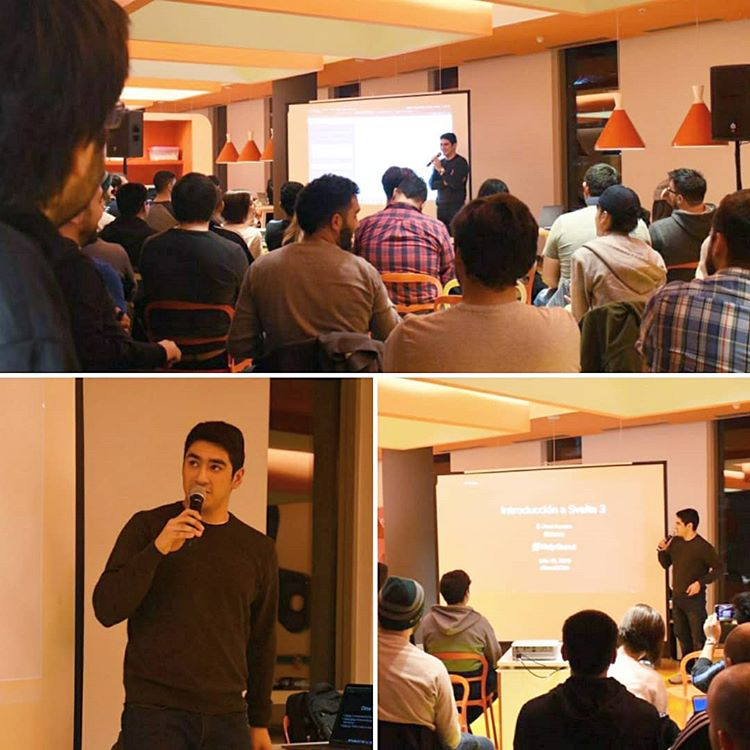

# Introducción a Svelte 3

Charla para [BeerJS Córdoba](https://beerjscba.com/) No. 32, presentada el 25 de Julio de 2019. La presentación está disponible [aquí](https://svelte-beerjs-es.surge.sh/).

**📽️ Mira el [video](https://www.youtube.com/watch?v=N5g0dFfz9iQ)**

Presentación hecha con [MDX Deck](https://github.com/jxnblk/mdx-deck).

# Photos

