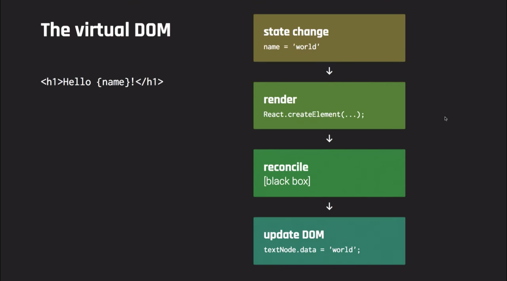
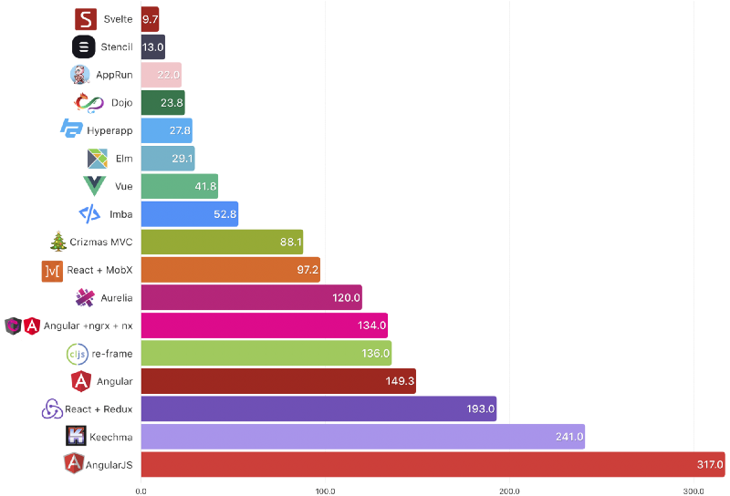

import { CodeSurfer } from "mdx-deck-code-surfer";
import { dark } from 'mdx-deck/themes'
import nightOwl from "prism-react-renderer/themes/nightOwl"
import Image from './components/image'
import { Image as MDXImage } from 'mdx-deck'
import { Split } from 'mdx-deck/layouts'

export const theme = {
  ...dark,
  font: 'Nunito, sans-serif',
  googleFont: 'https://fonts.googleapis.com/css?family=Nunito:300,300i,700',
  colors: {
    text: 'rgb(214, 222, 235)',
    link: 'rgb(214, 222, 235)',
    background: 'rgb(1, 22, 39)'
  }
}

# <👋> Hola

---

# Introducción a Svelte 3

👨‍💻 Maxi Ferreira<br/>
[@charca](https://www.twitter.com/charca)


Julio 25, 2019<br/>
#BeerJSCBA

---


---

<CodeSurfer
  title="Svelte 2 Syntax"
  theme={nightOwl}
  notes="🤔 Hmm... Vue sos vos?"
  code={require("!raw-loader!./snippets/00-svelte2.mdx")}
/>

---


---


[Rich Harris: Computer, build me an app](https://www.youtube.com/watch?v=qqt6YxAZoOc)

---


[Rich Harris: Rethinking Reactivity](https://www.youtube.com/watch?v=AdNJ3fydeao)

---


---

# Qué es Svelte?

---

# Svelte es...

# un framework

---

# Svelte es...

# un compilador

---

# Svelte es...

# un lenguaje

---


---

# 1. Write Less Code

---

<CodeSurfer
  title="Componente React"
  theme={nightOwl}
  notes="442 caracteres"
  code={require("!raw-loader!./snippets/01-react-component.mdx")}
/>

---

<CodeSurfer
  title="Componente Vue"
  theme={nightOwl}
  notes="263 caracteres"
  code={require("!raw-loader!./snippets/02-vue-component.mdx")}
/>

---

<CodeSurfer
  title="Componente Svelte"
  theme={nightOwl}
  notes="145 caracteres"
  code={require("!raw-loader!./snippets/03-svelte-component.mdx")}
/>

---

## Por qué importa?

```
"If debugging is the process of removing software bugs, then programming must be the process of putting them in."

— Edsger Dijkstra
```

---

# 2. No Virtual DOM

---

## No era que el Virtual DOM es más rápido que el DOM?

---



---


---


---

# 3. Truly Reactive

---

## Asignaciones Reactivas

---

<CodeSurfer
  title="Cambios de estado en React"
  theme={nightOwl}
  code={require("!raw-loader!./snippets/04-react-state.mdx")}
/>

---

<CodeSurfer
  title="Cambios de estado en Svelte 2"
  theme={nightOwl}
  code={require("!raw-loader!./snippets/05-svelte2-state.mdx")}
/>

---

<CodeSurfer
  title="Cambios de estado en Svelte 3"
  theme={nightOwl}
  code={require("!raw-loader!./snippets/06-svelte3-state.mdx")}
/>

---

## Declaraciones Reactivas

---

<video src="./images/spreadsheet.mov" controls autoPlay loop />

---

<CodeSurfer
  title="Assign Operator"
  theme={nightOwl}
  code={require("!raw-loader!./snippets/07-reactive1.mdx")}
/>

---

<CodeSurfer
  title="Destiny Operator"
  theme={nightOwl}
  code={require("!raw-loader!./snippets/08-reactive2.mdx")}
/>

---

<CodeSurfer
  title="Destiny Operator en Svelte 3"
  theme={nightOwl}
  notes="$: es un 'labeled statement'"
  code={require("!raw-loader!./snippets/09-reactive3.mdx")}
/>

---

# Performance

---



---

<video src="./images/svelte-performance-demo.mov" controls autoPlay loop />

---

# Ejemplos

---

<CodeSurfer
  title="Styling"
  theme={nightOwl}
  notes="https://svelte.dev/examples#nested-components"
  code={require("!raw-loader!./snippets/10-example-styling.mdx")}
/>

---

<CodeSurfer
  title="Props"
  theme={nightOwl}
  notes="https://svelte.dev/examples#default-values"
  code={require("!raw-loader!./snippets/11-example-props.mdx")}
/>

---

<CodeSurfer
  title="State"
  theme={nightOwl}
  notes="https://svelte.dev/examples#reactive-assignments"
  code={require("!raw-loader!./snippets/12-example-state.mdx")}
/>

---

<CodeSurfer
  title="Logic"
  theme={nightOwl}
  notes="https://svelte.dev/examples#else-if-blocks"
  code={require("!raw-loader!./snippets/13-example-logic.mdx")}
/>

---

<CodeSurfer
  title="Events"
  theme={nightOwl}
  notes="https://svelte.dev/examples#event-modifiers"
  code={require("!raw-loader!./snippets/14-example-events.mdx")}
/>

---

<CodeSurfer
  title="Bindings"
  theme={nightOwl}
  notes="https://svelte.dev/examples#text-inputs"
  code={require("!raw-loader!./snippets/15-example-bindings.mdx")}
/>

---

<CodeSurfer
  title="Lifecycle Events"
  theme={nightOwl}
  notes="https://svelte.dev/examples#onmount"
  code={require("!raw-loader!./snippets/16-example-lifecycle.mdx")}
/>

---

<CodeSurfer
  title="Stores"
  theme={nightOwl}
  notes="https://svelte.dev/examples#writable-stores"
  code={require("!raw-loader!./snippets/17-example-stores.mdx")}
/>

---

<CodeSurfer
  title="Transitions"
  theme={nightOwl}
  notes="https://svelte.dev/examples#transition"
  code={require("!raw-loader!./snippets/18-example-transitions.mdx")}
/>

---

export default Split

<video src="./images/demo.mp4" controls loop />

# Demo Time 🎉
## (Puede fallar 🤷‍♂️)

---

# Por dónde sigo?

- [svelte.dev](https://svelte.dev)
- Charlas de Rich Harris
  - [Computer, Build Me an App](https://www.youtube.com/watch?v=qqt6YxAZoOc)
  - [Rethinking Reactivity](https://www.youtube.com/watch?v=AdNJ3fydeao)
- [Tutorial oficial](https://svelte.dev/tutorial/)
- [Ejemplos y REPL](https://svelte.dev/examples)

---

# Otros Projectos

- [Sapper](https://sapper.svelte.dev): el Next.js/Nuxt de Svelte.
- [Svelte Native](https://svelte-native.technology/): framework de apps nativas basado en NativeScript.
- [Svelte GL](https://github.com/sveltejs/gl): WebGL render en Svelte.

---

# Gracias </👋>
[@charca](https://www.twitter.com/charca)
