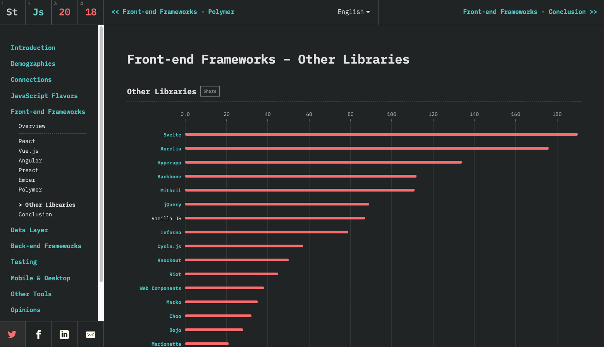
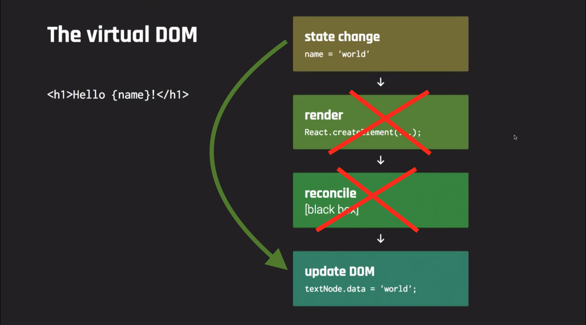

import { CodeSurfer } from "mdx-deck-code-surfer";
import { dark } from 'mdx-deck/themes'
import nightOwl from "prism-react-renderer/themes/nightOwl"
import Image from './components/image'
import { Image as MDXImage, Head } from 'mdx-deck'
import { Split } from 'mdx-deck/layouts'

export const theme = {
  ...dark,
  font: 'Nunito, sans-serif',
  googleFont: 'https://fonts.googleapis.com/css?family=Nunito:300,300i,700',
  colors: {
    text: 'rgb(214, 222, 235)',
    link: 'rgb(214, 222, 235)',
    background: 'rgb(1, 22, 39)'
  }
}

<Head>
  <title>Maxi Ferreira: Introduction to Svelte 3</title>
</Head>

# <👋> Hello

---

# Introduction to Svelte 3

👨‍💻 Maxi Ferreira<br/>
[@charca](https://www.twitter.com/charca)


July 25th, 2019<br/>
#BeerJSCBA

---


[Svelte 2 Homepage](https://v2.svelte.dev)

---

<CodeSurfer
  title="Svelte 2 Syntax"
  theme={nightOwl}
  notes="🤔 Hmm... this looks familiar"
  code={require("!raw-loader!./snippets/00-svelte2.mdx")}
/>

---



[State of JS 2018](https://2018.stateofjs.com/front-end-frameworks/other-libraries/)
---


[Rich Harris: Computer, build me an app](https://www.youtube.com/watch?v=qqt6YxAZoOc)

---


[Rich Harris: Rethinking Reactivity](https://www.youtube.com/watch?v=AdNJ3fydeao)

---


---

# What is Svelte?

---

# Svelte is...

# a framework

---

# Svelte is...

# a compiler

---

# Svelte is...

# a language

---


[Svelte 3 Homepage](https://svelte.dev)

---

# 1. Write Less Code

---

<CodeSurfer
  title="React Component"
  theme={nightOwl}
  notes="442 characters"
  code={require("!raw-loader!./snippets/01-react-component.mdx")}
/>

---

<CodeSurfer
  title="Vue Component"
  theme={nightOwl}
  notes="263 characters"
  code={require("!raw-loader!./snippets/02-vue-component.mdx")}
/>

---

<CodeSurfer
  title="Svelte Component"
  theme={nightOwl}
  notes="145 characters"
  code={require("!raw-loader!./snippets/03-svelte-component.mdx")}
/>

---

## Why does it matter?


> _"If debugging is the process of removing software bugs, then programming must be the process of putting them in."_

```
— Edsger Dijkstra
```

---

# 2. No Virtual DOM

---

## Wasn't the Virtual DOM faster than the real DOM?

---


##### Source: [Computer, build me an app](https://www.youtube.com/watch?v=qqt6YxAZoOc)

---



##### Source: [Computer, build me an app](https://www.youtube.com/watch?v=qqt6YxAZoOc) (edited)

---


##### Source: [Rethinking Reactivity](https://www.youtube.com/watch?v=AdNJ3fydeao)

---

# 3. Truly Reactive

---

## Reactive Assignments

---

<CodeSurfer
  title="Changing state in React"
  theme={nightOwl}
  code={require("!raw-loader!./snippets/04-react-state.mdx")}
/>

---

<CodeSurfer
  title="Changing state in Svelte 2"
  theme={nightOwl}
  code={require("!raw-loader!./snippets/05-svelte2-state.mdx")}
/>

---

<CodeSurfer
  title="Changing state in Svelte 3"
  theme={nightOwl}
  code={require("!raw-loader!./snippets/06-svelte3-state.mdx")}
/>

---

## Reactive Declarations

---

<video src="./images/spreadsheet.mov" controls autoPlay loop />

---

<CodeSurfer
  title="Assign Operator"
  theme={nightOwl}
  code={require("!raw-loader!./snippets/07-reactive1.mdx")}
/>

---

<CodeSurfer
  title="Destiny Operator"
  theme={nightOwl}
  code={require("!raw-loader!./snippets/08-reactive2.mdx")}
/>

---

<CodeSurfer
  title="Destiny Operator in Svelte 3"
  theme={nightOwl}
  notes="$: is a 'labeled statement'"
  code={require("!raw-loader!./snippets/09-reactive3.mdx")}
/>

---

# Performance

---


##### Source: [A RealWorld Comparison of Front-End Frameworks with Benchmarks (2019 update)](https://www.freecodecamp.org/news/a-realworld-comparison-of-front-end-frameworks-with-benchmarks-2019-update-4be0d3c78075/)

---

<video src="./images/svelte-performance-demo.mov" controls autoPlay loop style={{ width: '80%'}} />

##### Source: [Rethinking Reactivity](https://www.youtube.com/watch?v=AdNJ3fydeao)

---

# Examples

---

<CodeSurfer
  title="Styling"
  theme={nightOwl}
  notes="https://svelte.dev/examples#nested-components"
  code={require("!raw-loader!./snippets/10-example-styling.mdx")}
/>

---

<CodeSurfer
  title="Props"
  theme={nightOwl}
  notes="https://svelte.dev/examples#default-values"
  code={require("!raw-loader!./snippets/11-example-props.mdx")}
/>

---

<CodeSurfer
  title="State"
  theme={nightOwl}
  notes="https://svelte.dev/examples#reactive-assignments"
  code={require("!raw-loader!./snippets/12-example-state.mdx")}
/>

---

<CodeSurfer
  title="Logic"
  theme={nightOwl}
  notes="https://svelte.dev/examples#else-if-blocks"
  code={require("!raw-loader!./snippets/13-example-logic.mdx")}
/>

---

<CodeSurfer
  title="Events"
  theme={nightOwl}
  notes="https://svelte.dev/examples#event-modifiers"
  code={require("!raw-loader!./snippets/14-example-events.mdx")}
/>

---

<CodeSurfer
  title="Bindings"
  theme={nightOwl}
  notes="https://svelte.dev/examples#text-inputs"
  code={require("!raw-loader!./snippets/15-example-bindings.mdx")}
/>

---

<CodeSurfer
  title="Lifecycle Events"
  theme={nightOwl}
  notes="https://svelte.dev/examples#onmount"
  code={require("!raw-loader!./snippets/16-example-lifecycle.mdx")}
/>

---

<CodeSurfer
  title="Stores"
  theme={nightOwl}
  notes="https://svelte.dev/examples#writable-stores"
  code={require("!raw-loader!./snippets/17-example-stores.mdx")}
/>

---

<CodeSurfer
  title="Transitions"
  theme={nightOwl}
  notes="https://svelte.dev/examples#transition"
  code={require("!raw-loader!./snippets/18-example-transitions.mdx")}
/>

---

export default Split

<video src="./images/demo.mp4" controls autoPlay loop />

# Demo Time 🎉
## (It can go wrong 🤷‍♂️)

---

# Where do I go next?

- [svelte.dev](https://svelte.dev)
- Rich Harris' talks
  - [Computer, Build Me an App](https://www.youtube.com/watch?v=qqt6YxAZoOc)
  - [Rethinking Reactivity](https://www.youtube.com/watch?v=AdNJ3fydeao)
- [Official Tutorial](https://svelte.dev/tutorial/)
- [Examples and REPL](https://svelte.dev/examples)

---

# Other Projects

- [Sapper](https://sapper.svelte.dev): Next.js/Nuxt for Svelte.
- [Svelte Native](https://svelte-native.technology/): native apps framework based on NativeScript.
- [Svelte GL](https://github.com/sveltejs/gl): WebGL render in Svelte.

---

# Thank you </👋>
[@charca](https://www.twitter.com/charca)
